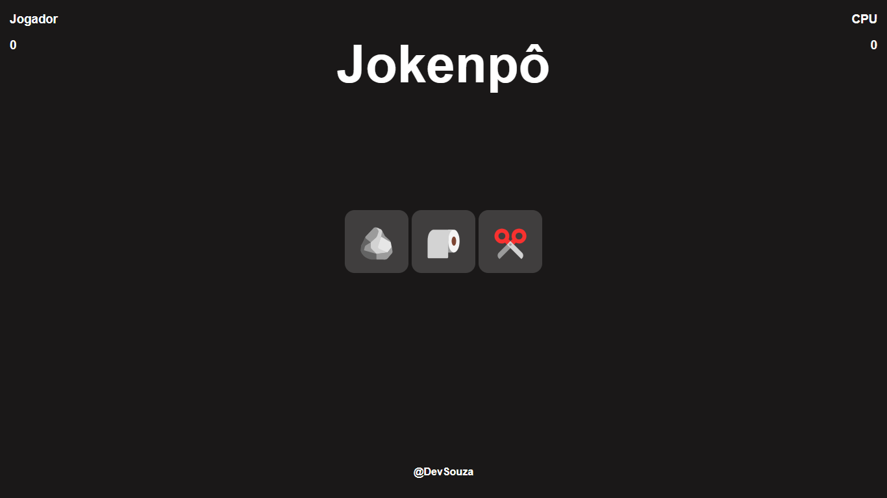

# Jokenpo
Este é um jogo interativo de Jokenpô (Pedra, Papel e Tesoura) desenvolvido com HTML, CSS e JavaScript. O jogo permite ao jogador escolher entre as opções e competir contra o computador.

## Tecnologias Usadas
- HTML
- CSS
- JavaScript

## Como Jogar
1. Escolha uma das opções: Pedra 🪨, Papel 🧻 ou Tesoura ✂️.
2. O computador faz a escolha aleatoriamente.
3. O jogo informa o vencedor: se você ganhou, perdeu ou empatou.
4. A pontuação do jogador será atualizada.
5. Você pode reiniciar o jogo a qualquer momento.

## Rodando o Jogo Localmente
1. Baixe o repositório.
2. Abra o arquivo `index.html` em seu navegador.
3. Divirta-se jogando Jokenpô!

## Link para a Aplicação hospedada no vercel.app
https://devsouza-jokenpo.vercel.app/
